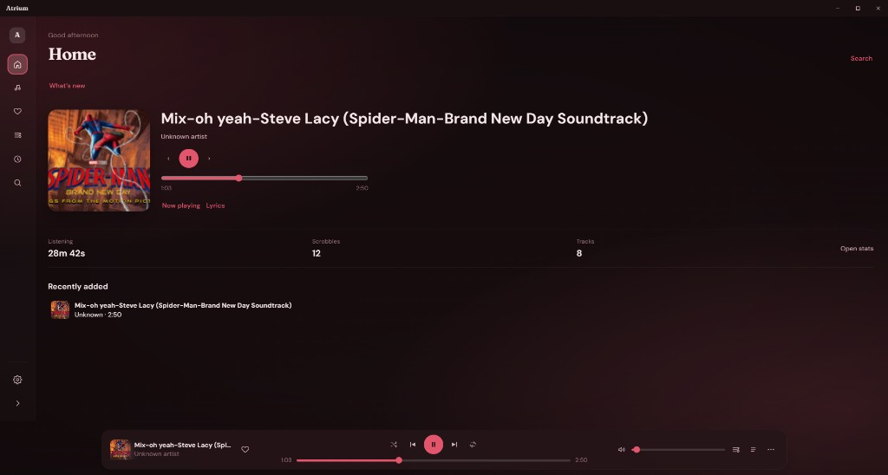
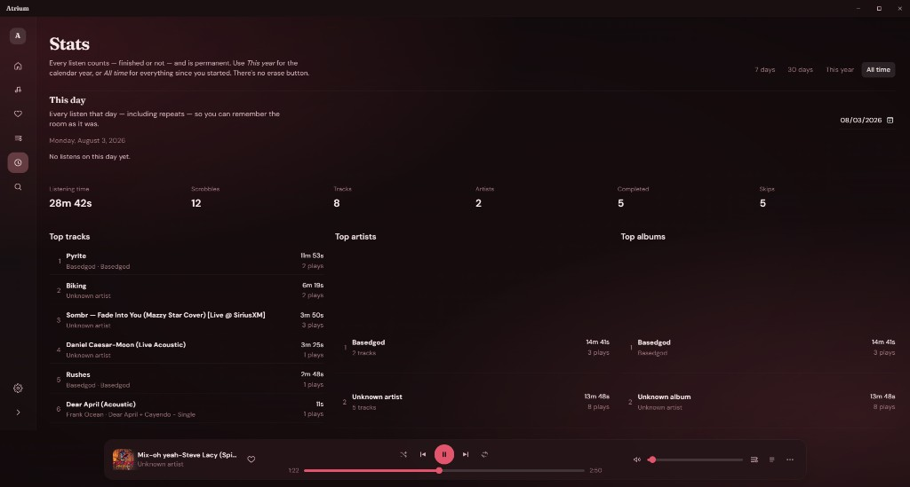

<p align="center">
  
</p>

# Atrium

A private listening room for **your** local music.

No accounts. No streaming. No cloud library. Songs stay on your computer — Atrium only indexes them.

## Download

**[Download the latest release](https://github.com/Salutatorian/atrium/releases/latest)**

| Platform | Get |
| --- | --- |
| **Windows** | `.exe` setup or `.msi` |
| **macOS** | Apple Silicon or Intel `.dmg` — first open: right-click → **Open** |
| **Linux** | AppImage, `.deb`, or `.rpm` |

## What it does

### Library & playback

Add folders or drop files. Browse songs, albums, artists, and playlists. Search, queue, shuffle, and play offline.

<p align="center">
  
</p>

### Liked & listening stats

Favorite tracks, see recently played, and check listening time and tops.

<p align="center">
  
</p>

<p align="center">
  
</p>

### Lyrics & themes

Synced lyrics when you have them (local files, optional online lookup). Themes and a quiet immersive player when you want to focus.

<p align="center">
  
</p>

## Privacy

Everything runs on your machine. Your library paths, listen history, and settings stay local. Optional network features (lyrics lookup, update checks) are off unless you turn them on.

## License

[Apache License 2.0](LICENSE). Copyright © 2026 [Salutatorian](https://github.com/Salutatorian).  
Third-party notices: [`docs/dependency-inventory.md`](docs/dependency-inventory.md).

## For developers

```bash
npm install
npm run tauri dev
```

Needs Node.js 20+, Rust stable, and the usual Tauri WebView deps for your OS.  
Build: `npm run tauri build` → installers under `src-tauri/target/release/bundle/`.

More design notes live under [`docs/`](docs/) if you need them.
